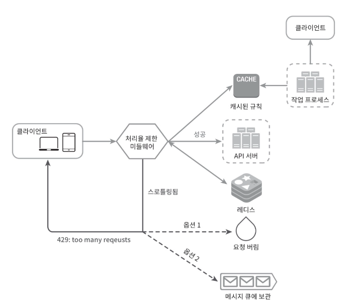
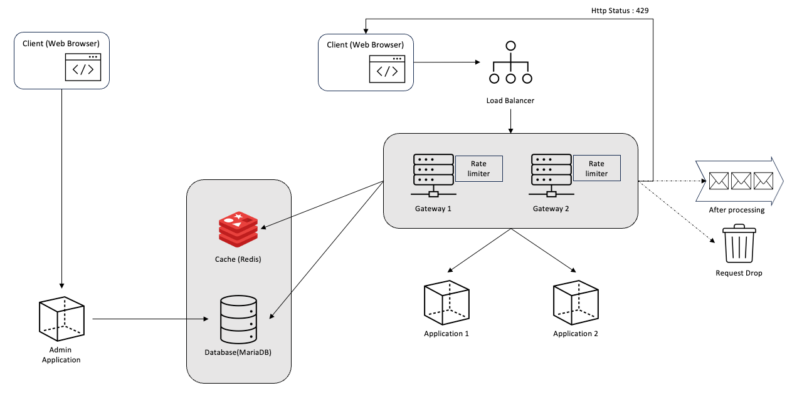

# Rate Limiter

이번에는 처리율 제한 장치에 대해서 직접 구현해보겠다. 아래 사진은 책에서 제공하는 상세 설계도이다.

실제 시스템을 구축하는 것에 목적보다는 처리율 계산기의 알고리즘을 구현해 보고 싶은 목적이 가장 컸다. 그러니 아래에 시스템 구성에서 이상한 부분이 있어도 넘어가 주길 바란다.

이 그림을 토대로 시스템 구조를 설계 한 다음 비즈니스 설계를 해보겠다.

아래 요구사항에 맞춰 이 글을 읽는분이 스스로 개발해봤으면 좋겠다.

## 개발 스팩

- Java 17
- Spring Boot 3.1.2
- Spring Cloud Gateway
- Spring Loadbalncer
- Thymeleaf
- Redis
- MariaDB
- RebbitMQ
- Gradle
- Docker, DockerCompose

## 요구사항 정리

- API 서버는 두 개의 마이크로 서비스를 구성할 예정이다. (중요한 부분이 아니기 때문에 간단한 컨트롤러만 제공)
- Spring Boot 의 로드 밸런서를 이용하여 API 게이트웨이를 분리 한다.
    - 병렬처리 구현을 위한 기능
- API 서버에 접근하기 위해서는 API 게이트웨이를 이용해 접근 하여야 한다.
- API 게이트웨이에서 처리율 제한을 진행해야 한다.
- 처리율 제한 미들 웨어의 동작방식을 결정하는 설정을 할 수 있어야 한다.
    - 설정은 MariaDB 에 저장
    - 별도의 Admin 콘솔을 제공

| 설정 | 설명 |
| --- | --- |
| 알고리즘 | 처리율 제한을 위한 알고리즘을 설정 할 수 있다. - 토큰 버킷 알고리즘 - 누출 버킷 알고리즘 - 고정 윈도 카운터 - 이동 윈도 로그 - 이동 윈도 카운터 #1 (선택) - 이동 윈도 카운터 #2 (선택) |
| 요청 사후 처리 | 요청에서 사후 처리 방식에 대해 설정할 수 있다. - 요청 버림 - 메시지 큐 저장 후 처리가 가능할 때 처리 진행  |
| 제한 기준 | 제한에 대한 기준을 설정할 수 있다. - 아이디 - IP |

- 처리율 제한 미들웨어의 설정은 기본적으로 캐시(Redis)에 Cache Aside 전략을 이용하여 읽어들이고 Write Around 전략을 이용해 데이터를 갱신 (캐시 전략 중 일반적으로 사용)
- 알고리즘 선택하면 처리율 제한은 해당 알고리즘을 이용해서 동작해야하며, 응답으로 어떠한 알고리즘을 선택했는지 알 수 있어야 한다.
- 요청 사후 처리를 선택하여 요청에 대한 버림 또는 큐에 저장한 후 사후처리가 가능하도록 해야한다.
    - 사후 처리에 사용하는 메시지 큐는 RebbitMQ 를 사용
- UI 는 Thymeleaf 를 이용하여 제공하며, 브라우저 환경만 제공한다. (선택)
- TDD 를 이용하여 개발 진행 (선택)

## 시스템 구성도

시스템을 보면 먼저 어드민 애플리케이션을 이용해서 데이터베이스에 설정을 주입해 주어야 한다. 그렇기 때문에 최초 기동시에는 무조건 기본 설정으로 데이터가 들어가 있어야 한다.

## 애플리케이션 설명

실제 설계는 각각에 애플리케이션과 서비스를 구현 할 때 설계 → 구현으로 정리해서 포스팅 할 예정이다.

### Admin Application

처리율 제한기에서 사용되는 알고리즘과, 임계치, 사후 처리방식, 처리 제한 기준에 대해 설정을 하는 역할을 한다. 따라서, GET, PUT method 2가지의 API 만 제공하면 된다.

구현은 Spring Boot 기반으로 구현할 예정이다.

### API Gateway

애플리케이션을 찾아가는역할을 하는 엔드포인트로 내부에 처리율 제한기가 실제 탑제될 예정이다.

사용자 인증 정보는 하드코딩으로 2~3개의 사용자만 등록해서 사용할 예정이다. 사용자의 인증은 없이 그냥 사용자와 패스워드가 맞으면 애플리케이션으로 요청을 보내는 방식으로 간단하게 구현하겠다.

- 토큰 발급, 인증 세션 같은 인증/인가 로직 제외하고 개발

구현은 Spring Boot, Spring Cloud Gateway 를 이용해 구현할 예정이다.

### Load Balancer

API Gateway 의 부하분한을 하는 역할을 한다. 병렬처리에 대한 실습을 위해 간단하게 구현하여 사용할 예정이다.

구현은 Spring Boot, Spring Cloud LoadBalancer 을 이용해 구현할 예정이다.

### Application #1 #2

그냥 구현 하는 서버이다. API 만 제공할 생각이다.

## 구현 순서

1. [Application 1, 2](docs/application.md)
2. API Gateway (Rate Limiter)
3. Admin Application
4. Load Balancer

### Build

### Run