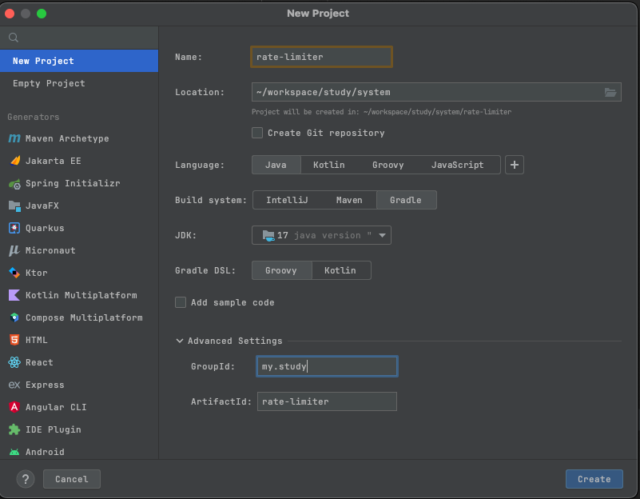
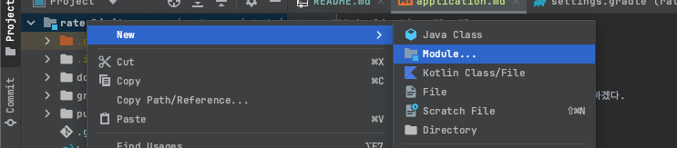

# Application #1, #2

## 프로젝트 생성

스프링 프로젝트를 기반으로 간단한 애플리케이션을 구현하겠다.

먼저 비어있는 프로젝트를 생성해 주었다.



프로젝트를 생성하면 맨 처음 src 경로가 있는데 제거했다.
아래는 최초의 프로젝트 구조이다.

```text
rate-limiter
|-> .gradle
|-> gradle
|-> .gitignore
|-> build.gradle
|-> gradlew
|-> gradlew.bat
|-> README.md
|-> settings.gradle  
```

여기에 application 모듈을 추가해 주겠다.



스프링 프로젝트로 간단한 프로젝트를 만들자 이 부분은 따로 사진을 올리지 않겠다.

```text
rate-limiter
...

|-> application-1  // 추가
|-> application-2  // 추가

...
```

## 구현

각각의 애플리케이션 포트는 8081 8082 로 설정하겠다.
각 설정은 한단계 한단계 진행하면서 점진적으로 추가해 나가겠다.

### 서버 설정

**application-1 properties**

```properties
server.port=8081 
```

**application-2 properties**

```properties
server.port=0802 
```

### API 구현 

**application-1 API**
```java
@RestController
public class HelloController {
    @GetMapping("/hello")
    public String hello() {
        return "hello";
    }
}
```

**application-2 API**
```java
@RestController
public class FooController {
    @GetMapping("/foo")
    public String foo() {
        return "foo";
    }
}
```

## 여기까지 

애플리케이션은 크게 기능도 없고 그냥 통신용으로 열어 두는거라 별게 없다. 다음 정리부터 본격적으로 처리율 제한 알고리즘을 설계하고 구현해보자.