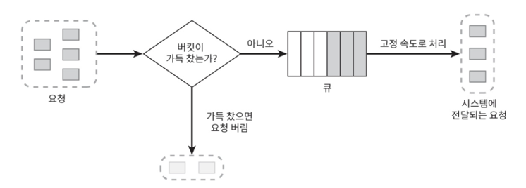

## 누출 버킷 알고리즘

요청이 들어오면 토큰을 생성하여 버킷에 저장한 다음 요청을 처리하는 알고리즘으로 버킷이 꽉 차 있으면 그 다음에 들어오는 요청은 버리고, 버킷에 빈 공간이 있을 경우 다시 요청이 가능한 알고리즘이다.

토큰은 주기적으로 비어지며 버킷이 비어있으면 비우는 작업을 진행하지 않는다.

아래는 누출 버킷의 간략한 예시이다.

그럼 먼저 요구사항을 도출해보자.

### 요구사항