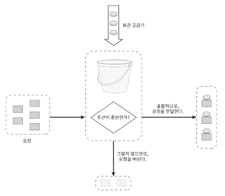
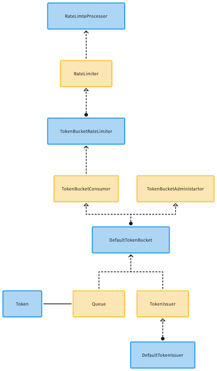

## 토큰 버킷 알고리즘

토큰을 담는 컨테이너인 토큰 버킷을 이용하는 알고리즘으로 버킷에 토큰이 있으면 해당 토큰을 이용하여 트래픽을 처리하게 되며, 토큰 버킷에 토큰이 없으면 트래픽은 사후 처리 로직에 따라 처리되며 HTTP 응답으로
429 Error 를 전달한다.

버킷은 주기적으로 토큰이 채워지며, 버킷에 토큰이 꽉 차 있으면 더이상 토큰이 추가되지는 않는다.

아래는 이해를 돕기 위한 토큰 버킷을 이용한 트래픽 처리 제한 장치의 그림이다.



그러면 이제부터 토큰 버킷 알고리즘을 구하기 위한 요구사항을 분석해보자.

### 요구사항

일반적으로 API 서버가 올라가면 API end-point 마다 별도의 토큰 버킷을 할당한다. 또 한, IP 주소 별로 제한한다면 IP 주소마다 버킷을 하나씩 할당 해야 한다.

앞서 정의한 요구사항을 다시 한 번 확인해보자.

**[기본 요구사항]**

- 처리율 제한은 IP 별 또는, API 요청 별로 처리해야 한다.

위 요구사항은 어더한 기준으로 처리할 것인지에대한 처리 알고리즘의 공통 요소이다.

위 그림을 분석하면서 알고리즘 구현의 요구사항을 추가로 정리해보자.

**[추가 요구사항]**

- (공통) API 요청의 제한을 위한 임계치를 지정해야 한다.
- (버킷) 토큰 공급 주기를 설정할 수 있어야 한다.

추가 요구사항 중 공통 사항은 다른 알고리즘에 같이 적용되어야 할 항목이다. 여기서 임계치는 버킷의 사이즈를 지정한다. 또 한 토큰의 공급 주기를 설정하여 버킷에 토큰이 영구 고갈 되는 것을 방지해야 한다.

여기서 마지막 요구사항을 추가하겠다.

**[마지막 요구사항]**

- 임계치는 60 ~ 300 으로 지정하겠다. (1 초당 1번의 요청이 발생한다는 가정)
- 토큰의 공급 주기는 30 ~ 90 으로 지정 하며, 단위는 초이다.
- 토큰의 공급 크기 10 ~ 60 으로 하며, 임계치 보다 클 수 없다.

그러면 위 요구사항들을 기준으로 구현을 해보겠다.

### 행동과 객체를 분리

구현에 앞서 토큰 버킷 알고리즘의 행동을 구분해보겠다.

- 토큰 공급기 (TokenGenerator) 는 토큰을 생성한 후 주기적으로 토큰 버킷(TokenBucket) 에 저장한다.
- 요청이 들어오면 토큰 버킷이 비어있는지 확인 한 다음 비어있지 않으면 토큰을 가져와 요청을 처리하고, 비어 있으면 요청을 버린다.

행동 자체는 정말 간단하다. 그러면 행동과 객체를 한번 분리해보겠다.

**[행동]**

- 토큰을 생성
- 토큰을 버킷에 저장
- 버킷이 비어있는지 확인
- 토큰을 가져온다
- 토큰은 버킷에서 제거

**[객체]**

- 토큰 공급기
- 토큰 버킷
- 토큰 처리기
- 토큰

다음으로 API Gateway 모듈을 만들 것이다.

- 앞 장에서 정의한 요구사항대로 API Gateway 에 처리율 제한기를 구현할 예정이었으나, Spring Cloud Gateway 의 RateLimiter 기능을 이용해 볼 예정이다.

Spring Initializr(오타 아니고 진짜 이거였다.. 처음알았다.) 를 이용해 모듈을 생성해주면 된다.

- 앞서 rate-limiter project 를 생성했으며, 그 하위에 생성하면 된다

다음으로 Spring Boot 의존성 추가이다.

나는 일단 아래의 4개만 추가했다.

- Developer Tools > Lombok
- Web > Spring Web
- Routing > Spring Gateway
- I/O > Validation

> 나는 IntelliJ Ultimate Edition 을 사용중이라 프로젝트 생성시 Spring Initializr 을 이용 가능하지만 불가능한
> 분은 [start.spring.io](http://start.spring.io) 에서 생성하면 된다.
>

```groovy
// build.gradle
plugins {
    id 'java'
    id 'org.springframework.boot' version '3.1.2'
    id 'io.spring.dependency-management' version '1.1.2'
}

group = 'my.study'
version = '0.0.1-SNAPSHOT'

java {
    sourceCompatibility = '17'
}

configurations {
    compileOnly {
        extendsFrom annotationProcessor
    }
}

repositories {
    mavenCentral()
}

ext {
    set('springCloudVersion', "2022.0.4")
}

dependencies {
    implementation 'org.springframework.boot:spring-boot-starter-validation'
    implementation 'org.springframework.boot:spring-boot-starter-webflux'
    implementation 'org.springframework.cloud:spring-cloud-starter-gateway'
    compileOnly 'org.projectlombok:lombok'
    annotationProcessor 'org.projectlombok:lombok'
    testImplementation 'org.springframework.boot:spring-boot-starter-test'
    testImplementation 'io.projectreactor:reactor-test'
}

dependencyManagement {
    imports {
        mavenBom "org.springframework.cloud:spring-cloud-dependencies:${springCloudVersion}"
    }
}

tasks.named('test') {
    useJUnitPlatform()
}
```

### 구현




일단 위와 같이 객체를 분리해봤다.

먼저 요청이 들어오면 처리제한을 하기위한 Processor 과 그 Processor 에서 실제 처리율 제한을 담당하는 RateLimiter 분리했다.


**[TokenIssuer]**

```java
import java.util.List;

public interface TokenIssuer {
    List<Token> issueTokens();
}
```

```java
import java.util.List;
    import java.util.stream.Collectors;
    import java.util.stream.IntStream;

/**
 * 토큰 발급기
 * - 토큰을 생성하는 토큰 발급기다.
 * - 프로세서가 토큰을 생성할 때 사용한다.
 * - 이 객체는 불변 객체이며 토큰 이슈를 생성할 때 새로운 인스턴스를 생성하여 토큰 프로세서에 주입한다.
 * - 주의할 점은 해당 내용은 변경이 자주 발생하지 않으므로 캐시에 저장해놓고 사용하면 된다.
 */
public class DefaultTokenIssuer implements TokenIssuer {
    /**
     * 토큰 재발급 주기 이다.
     */
    private int refillCycle;
    /**
     * 토큰 재발급 크기 이다.
     */
    private int refillSize;

    /**
     * 토큰 재발급 주기와 크기를 받아 검증하고 값을 할당하여 인스턴스를 생성한다.
     *
     * @param refillCycle : 30 ~ 90 분
     * @param refillSize  : 10 ~ 60 개
     */
    public DefaultTokenIssuer(int refillCycle, int refillSize) {
        this.refillCycleValid(refillCycle);
        this.refillSizeValid(refillSize);

        this.setRefillCycle(refillCycle);
        this.setRefillSize(refillSize);
    }

    /**
     * 토큰 재발급 주기를 검증한다.
     * - 검증 실패시 ${@link IllegalArgumentException} 을 발생한다.
     *
     * @param refillCycle
     */
    private void refillCycleValid(int refillCycle) {
        if (refillCycle > 90 || refillCycle < 30) {
            throw new IllegalArgumentException("토큰 공급 주기는 30 ~ 90 사이입니다.");
        }
    }

    /**
     * 토큰 재발급 사이즈를 검증한다.
     * - 검증 실패시 ${@link IllegalArgumentException} 을 발생한다.
     *
     * @param refillSize
     */
    private void refillSizeValid(int refillSize) {
        if (refillSize > 60 || refillSize < 10) {
            throw new IllegalArgumentException("토큰 공급 크기는 10 ~ 60 사이입니다.");
        }
    }

    private void setRefillCycle(int refillCycle) {
        this.refillCycle = refillCycle;
    }

    private void setRefillSize(int refillSize) {
        this.refillSize = refillSize;
    }

    /**
     * 토큰을 발급한다.
     *
     * @return List
     */
    public List<Token> issueTokens() {
        int refillSize = this.refillSize;
        return IntStream.range(0, refillSize)
            .mapToObj(i -> Token.generate())
            .collect(Collectors.toList());
    }

    /**
     * TokenIssuer Factory Method
     *
     * @param refillCycle
     * @param refillSize
     * @return TokenIssuer
     */
    public static DefaultTokenIssuer create(int refillCycle, int refillSize) {
        return new DefaultTokenIssuer(refillCycle, refillSize);
    }
}

```

토큰 발행을 위한 공급기이다. `issueToken()` 메서드를 이용하여 토큰을 발생하고 있다. 여기서 발생한 토큰은 아래 나올 `TokenBucket` 에 저장되고 소모하게 된다.

**[TokenBucket]**
```java

/**
 * 토큰 버킷을 관리하기 위한 인터페이스
 */
public interface TokenBucketAdministrator {
    /**
     * 임계치를 변경 하기 위한 메서드
     * @param limit
     */
    void changeLimit(int limit);

    /**
     * 토큰 발행 주기와 크기를 변경하기 위한 메서드
     * @param refillCycle
     * @param refillSize
     * @return
     */
    TokenIssuer changeTokenIssuer(int refillCycle, int refillSize);

    /**
     * 토큰을 재발행 하기 위한 메서드
     */
    void refillTokens();
    /**
     * 토큰이 가득차있는지 확인한다. 
     * @return
     */
    boolean isFull();
}
```
```java
import java.util.Optional;

/**
 * 토큰 버킷 소비자로 RateLimiter 에서 호출되어 사용한다.
 */
public interface TokenBucketConsumer {
    /**
     * 토큰을 반환한다.
     * @return
     */
    Optional<Token> getToken();

    /**
     * 토큰의 사이즈를 반환한다
     * @return
     */
    int tokenContainsSize();

    /**
     * 토큰이 비어있는지 확인한다.
     * @return
     */
    boolean isEmpty();


}
```
```java
import java.util.Collection;
import java.util.List;
import java.util.Optional;
import java.util.Queue;
import java.util.concurrent.ConcurrentLinkedQueue;

/**
 * 토큰 버킷
 * - 토큰을 담고 있는 역할을 한다.
 */
public class DefaultTokenBucket implements TokenBucketAdministrator, TokenBucketConsumer {
    private int limit;
    private TokenIssuer tokenIssuer;
    private Queue<Token> tokens;

    public DefaultTokenBucket() {
        this(60, 10, 30);
    }

    /**
     * 토큰 버킷 사이즈와, 토큰 발급 장치의 정보를 받아 토큰 버킷의 인스턴스를 생성한다.
     *
     * @param limit
     * @param refillSize
     * @param refillCycle
     */
    public DefaultTokenBucket(int limit, int refillSize, int refillCycle) {
        this.limitValid(limit);
        this.setLimit(limit);
        this.setTokenIssuer(refillCycle, refillSize);
        this.tokens = new ConcurrentLinkedQueue<Token>();
    }

    @Override
    public void changeLimit(int limit) {
        this.limitValid(limit);
        this.setLimit(limit);
    }

    private void limitValid(int limit) {
        if (limit > 300 || limit < 60) {
            throw new IllegalArgumentException("임계치는 60 ~ 300 사이입니다.");
        }
    }

    private void setLimit(int limit) {
        this.limit = limit;
    }

    @Override
    public TokenIssuer changeTokenIssuer(int refillCycle, int refillSize) {
        this.setTokenIssuer(refillCycle, refillSize);
        return this.tokenIssuer;
    }

    private void setTokenIssuer(int refillCycle, int refillSize) {
        this.tokenIssuer = DefaultTokenIssuer.create(refillCycle, refillSize);
    }

    @Override
    public boolean isEmpty() {
        return this.tokens.isEmpty();
    }

    @Override
    public boolean isFull() {
        return this.tokens.size() == this.limit;
    }


    @Override
    public int tokenContainsSize() {
        return this.tokens.size();
    }

    @Override
    public Optional<Token> getToken() {
        if (this.isEmpty()) {
            return Optional.empty();
        }
        return Optional.ofNullable(this.tokens.poll());
    }

    @Override
    public void refillTokens() {
        List<Token> issuedToken = this.tokenIssuer.issueTokens();
        this.tokens.addAll(this.subToken(issuedToken));
    }

    private Collection<? extends Token> subToken(List<? extends Token> issuedToken) {
        int addableTokenSize = this.addableTokenSize(issuedToken.size());
        return issuedToken.subList(0, addableTokenSize);
    }

    private int addableTokenSize(int size) {
        if (this.checkOverflowForIssuedTokenSizeLimit(size)) {
            return size;
        }
        return this.limit - this.tokenContainsSize();
    }

    private boolean checkOverflowForIssuedTokenSizeLimit(int size) {
        return this.limit > this.tokenContainsSize() + size;
    }
}

```

토큰을 소비하기 위해 사용하는 인터페이스와 토큰을 생성하기 위한 인터페이스를 분리하였다. 

**[RateLimiter]**

```java
import my.study.gateway.algorithm.rate_limiter.token_bucket.Token;
import org.springframework.http.HttpMethod;

import my.study.gateway.algorithm.rate_limiter.RateLimiter;
import my.study.gateway.algorithm.rate_limiter.status.ThresholdExceeded;
import org.springframework.http.HttpMethod;

/**
 * 토큰 버킷 처리율 제한기이다.
 */
public class TokenBucketRateLimiter implements RateLimiter {
    private TokenBucketConsumer tokenBucketConsumer;

    public TokenBucketRateLimiter(TokenBucketConsumer tokenBucketConsumer) {
        this.tokenBucketConsumer = tokenBucketConsumer;
    }

    @Override
    public Token checkLimit(HttpMethod method, String endpoint) {
        return this.tokenBucketConsumer.getToken()
            .orElseThrow(() -> new ThresholdExceeded(method, endpoint));
    }
}

```

토큰 버킷 처리율 제한기의 구현체로 임계치를 확인하는 로직이 존재한다.

토큰 버킷에 토큰이 없으면 `ThresholdExceeded` 익셉션을 발생하는것을 확인할 수 있다. Processor 또는 Filter 에서 해당 익셉션을 Catch 하여 429 Error 을 발생하면 된다.

**[RateProcessor]**

```java

import my.study.gateway.algorithm.rate_limiter.token_bucket.Token;
import org.springframework.http.server.reactive.ServerHttpRequest;

public class RateLimitProcessor {
    private RateLimiter rateLimiter;
    private static final String HEADER = "rate-limiter-token";

    public RateLimitProcessor(RateLimiter rateLimiter) {
        this.rateLimiter = rateLimiter;
    }


    /**
     * 임계값을 확인하여 접근 가능한 토큰을 발급 받는다.
     * - 해당 토큰은 여러 가지에서 사용할 수 있다.
     * @param request ${@link ServerHttpRequest}
     * @return token ${@link Token}
     */
    public void thresholdCheck(ServerHttpRequest request) {
        Token token = this.rateLimiter.checkLimit(request.getMethod(), request.getURI().getPath());

        request.getHeaders().add(HEADER, token.getTokenId().toString());
    }
}


```

여기서 `ServerHttpRequest` 인터페이스를 받아 사용하고 있는데 해당 부분은 Spring Cloud Gateway 에서 사용할 수 있는 Reactive Http Request Component 이다.

Spring Cloud Gateway 에서 Custom Filter 을 처리율 계산을 위한 필터를 생성한다음에 RateLimitProcess 를 이용해서 처리해주면 된다.

> **[참고]** 자세한건 Spring Cloud Gateway 적용하면서 한번 정리하겠다.
> - https://kingchan223.tistory.com/398
> - https://docs.spring.io/spring-framework/docs/current/javadoc-api/org/springframework/http/server/reactive/ServerHttpRequest.html

물론 여기서 빠진 부분과 잘못된 추상화 부분들이 몇가지 있기는 하다. 빠진 부분은 TokenIssuer 교체 작업을 진행할 때 비교하는 로직이 빠져있다. 
또한, 잘못된 추상화 부분이 몇 군데 보인다. 다른 처리율 계산기를 적용하게 되면 추상화가 잘못되어있다는것을 알 수 있다. 이 부분은 처리율 계산기 알고리즘을 하나하나 구현하면서 맞춰가보자.

## 마무리

토큰 버킷 알고리즘을 구현 해봤지만 단순한 행동만을 넣어봤다. 일단 열심히 알고리즘 구현 해보도록 하자 

다음 포스팅은 누출 버킷 알고리즘이다. 